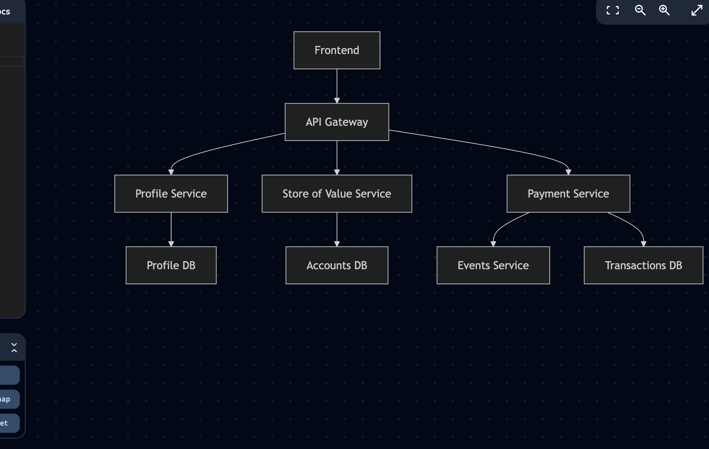

# 🏦 Banking Microservices Platform

## 🚀 Project Overview
> A scalable, secure banking platform using a **microservices** architecture.

**Built With:**
- Java 17 (Spring Boot 3)
- ReactJS (frontend)
- KrakenD (API Gateway)
- RabbitMQ (messaging)
- PostgreSQL (databases)
- Docker Compose (deployment)

## 🏛️ Architecture Diagram


## 🧩 Microservices Overview
| Service | Description |
|---------|-------------|
| **Profile Service** | Manage customer profiles, authentication (JWT), RBAC |
| **Store of Value Service** | Manage bank accounts (creation, update, balance inquiry) |
| **Payment Service** | Handle withdrawals, topups, transfers (async) |
| **Events Service** | Send notifications after transactions |
| **API Gateway (KrakenD)** | Central routing, JWT validation, aggregation |
| **Frontend (ReactJS)** | Customer portal (balances, transfers, notifications) |

## 🗂️ Directory Structure
```
/banking-platform
├── /profile-service
├── /store-of-value-service
├── /payment-service
├── /events-service
├── /gateway (krakend)
├── /frontend (react)
├── docker-compose.yml
├── README.md
└── Architecture.png
```

## 📦 Services Breakdown

<details>
<summary>🔐 Profile Service</summary>

- **Endpoints**:
  - `POST /api/auth/register`
  - `POST /api/auth/login`
  - `PUT /api/profile/update`
- **Security**:
  - JWT-based authentication
  - Role-based authorization
</details>

<details>
<summary>🏦 Store of Value Service</summary>

- **Endpoints**:
  - `POST /api/accounts`
  - `GET /api/accounts/{id}`
  - `PUT /api/accounts/{id}/activate`
- **Database**:
  - PostgreSQL table linked to profile IDs
</details>

<details>
<summary>💸 Payment Service</summary>

- **Endpoints**:
  - `POST /api/transactions/topup`
  - `POST /api/transactions/withdraw`
  - `POST /api/transactions/transfer`
- **Transactions**:
  - Event-driven via RabbitMQ
  - Strong idempotency and concurrency handling
</details>

<details>
<summary>📢 Events Service</summary>

- **Listens To**:
  - `TransactionCompletedEvent`
- **Sends**:
  - Email/SMS notifications (mocked)
</details>

<details>
<summary>🛡️ API Gateway (KrakenD)</summary>

- **Routes**:
  - `/api/me/accounts`
  - `/api/transactions`
- **Security**:
  - JWT validation
  - Aggregates backend services
</details>

<details>
<summary>🖥️ Frontend (ReactJS)</summary>

- **Features**:
  - Registration/Login
  - View balances
  - Initiate transfers
  - Receive notifications
</details>

## ⚙️ Local Setup

1. **Clone Repo**:
   ```bash
   git clone <repo-url>
   cd banking-platform
   ```

2. **Build Services**:
   ```bash
   mvn clean install
   ```

3. **Start Services**:
   ```bash
   docker-compose up --build
   ```

4. **Access Services**:
   - Frontend: `http://localhost:3000`
   - API Gateway: `http://localhost:8080`
   - Profile Service: `http://localhost:8081`
   - Store of Value Service: `http://localhost:8082`
   - Payment Service: `http://localhost:8083`
   - Events Service: `http://localhost:8084`

## 🧪 Testing Strategy

- Unit tests: **JUnit 5**
- Mocking services: **Mockito**
- Database tests: **Testcontainers**
- Edge Cases Covered:
  - Insufficient balance
  - Invalid account numbers
  - Duplicate transactions

## 📚 API Documentation

- Profile Service: `http://localhost:8081/swagger-ui.html`
- Store of Value Service: `http://localhost:8082/swagger-ui.html`
- Payment Service: `http://localhost:8083/swagger-ui.html`

## ✨ Technical Highlights

- Microservice-first architecture
- Asynchronous transaction processing (RabbitMQ)
- JWT-based secure authentication
- API Gateway aggregation (KrakenD)
- Docker Compose orchestration for local dev
- Built for horizontal scaling and resilience

# 🎯 Done!
